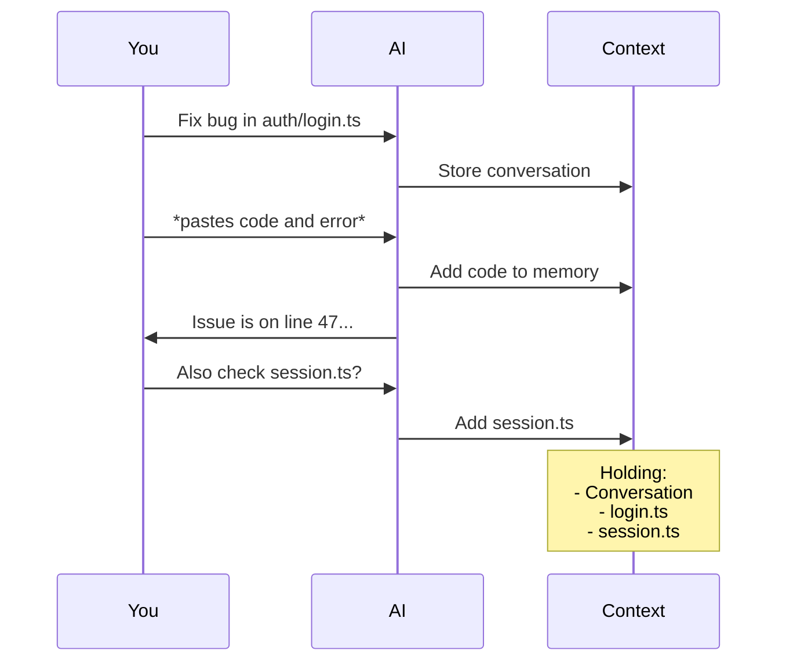
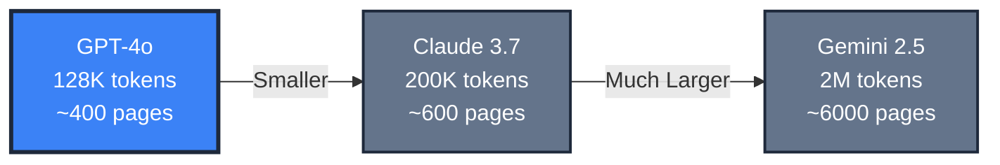
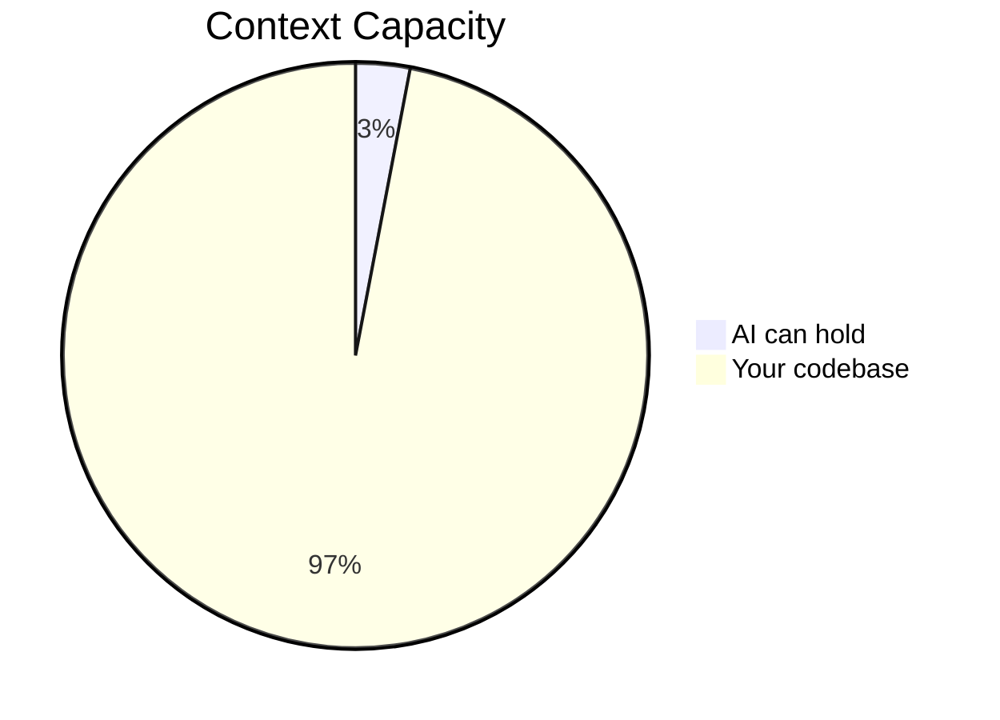
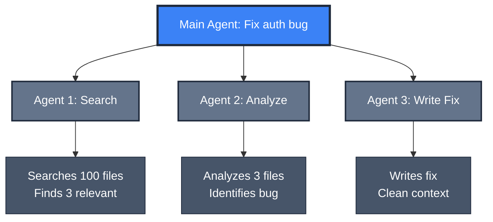
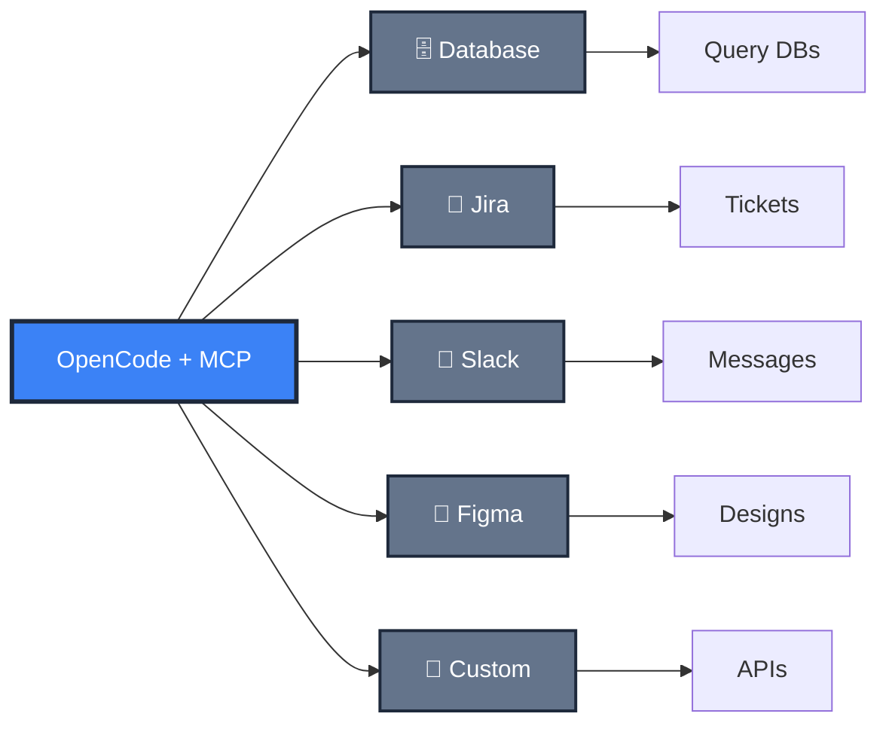
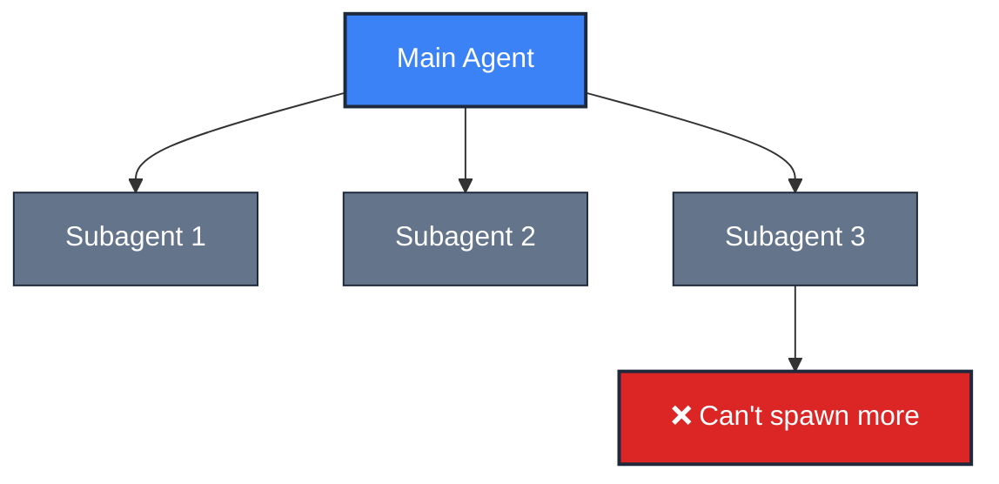
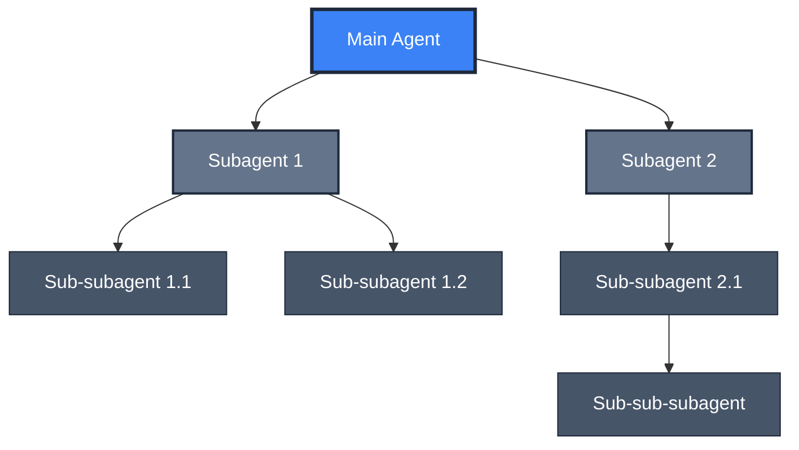
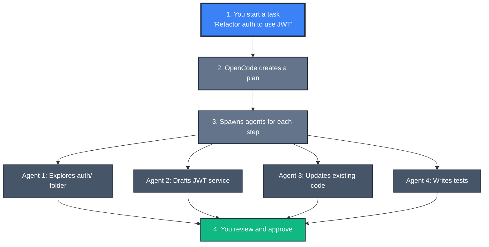

<style>
.slidev-layout {
  background: #0f172a;
  color: #e2e8f0;
  font-size: 0.9rem;
}

h1 {
  color: #f8fafc;
  font-weight: 700;
  font-size: 2.5rem !important;
  margin-bottom: 1rem;
}

h2, h3 {
  color: #cbd5e1;
  font-size: 1.5rem;
}

.part-divider {
  background: #1e293b;
  padding: 2rem;
  border-radius: 0.5rem;
  border-left: 4px solid #3b82f6;
}

.strategy-card {
  background: #1e293b;
  border: 1px solid #334155;
  border-radius: 0.5rem;
  padding: 1rem;
  transition: all 0.3s ease;
  font-size: 0.9rem;
}

.strategy-card:hover {
  border-color: #3b82f6;
  box-shadow: 0 4px 12px rgba(59, 130, 246, 0.1);
}

.comparison-grid {
  display: grid;
  grid-template-columns: 1fr 1fr;
  gap: 1.5rem;
  margin-top: 1.5rem;
}

.tool-card {
  background: #1e293b;
  border: 1px solid #334155;
  border-radius: 0.5rem;
  padding: 1.25rem;
  font-size: 0.85rem;
}

.feature-badge {
  display: inline-block;
  background: #1e293b;
  color: #3b82f6;
  border: 1px solid #3b82f6;
  padding: 0.2rem 0.6rem;
  border-radius: 0.25rem;
  font-size: 0.8rem;
  font-weight: 600;
  margin: 0.2rem;
}

.emoji-large {
  font-size: 2.5rem;
  margin-bottom: 0.5rem;
}

table {
  font-size: 0.85rem;
}

ul, ol {
  font-size: 0.9rem;
}

.mermaid {
  transform: scale(0.85);
  transform-origin: center;
}
</style>

# Session Three

<div class="text-4xl mb-3">🚀</div>

## Beyond Context - OpenCode

<div class="opacity-80 text-xl mt-4">Understanding the limits and discovering alternatives</div>

---
layout: center
background: '#0f172a'
---

# Before We Start

<div class="mt-8 text-xl space-y-6">

<div class="text-4xl mb-3">🤝</div>

**This is a learning session, not a sales pitch**

<div class="grid grid-cols-2 gap-8 mt-8 text-left">

<div class="strategy-card">

**📚 Learning Together**
- Not an AI expert, just exploring
- Figuring this out as a team

</div>

<div class="strategy-card">

**💬 Open Discussion**
- Questions encouraged
- Share your experiences

</div>

</div>

<div class="mt-6 text-xl">
<span class="feature-badge">Goal: Understand & make informed choices</span>
</div>

</div>

---
background: '#0f172a'
---

# Recap: Our Journey So Far

<div class="comparison-grid mt-8">

<div class="tool-card">

### 🎯 Session One
**From Chatbot to Agent**

- AI without context vs. with context
- Demo: Same prompt, different results
- Context-aware tools
- Direct file modification

</div>

<div class="tool-card">

### 🎨 Session Two
**Prompt Engineering**

- The 5 Pillars framework
- Iterative refinement
- Common anti-patterns
- When NOT to use AI
- Sharing prompts with the team

</div>

</div>

---
layout: center
background: '#0f172a'
class: text-center
---

# Today's Journey

<div class="grid grid-cols-2 gap-4 mt-6 text-left">

<div class="strategy-card">
<div class="text-3xl mb-2">🧠</div>

**Part 1: Understanding the Limits**
<div class="opacity-80 text-xs mt-1">15 min</div>

Context windows and 6 management strategies

</div>

<div class="strategy-card">
<div class="text-3xl mb-2">🔍</div>

**Part 2: Where We Are Today**
<div class="opacity-80 text-xs mt-1">5 min</div>

GitHub Copilot: What works, what's missing

</div>

<div class="strategy-card">
<div class="text-3xl mb-2">⚡</div>

**Part 3: OpenCode Alternative**
<div class="opacity-80 text-xs mt-1">10 min</div>

What it is, how it differs, when to use it

</div>

<div class="strategy-card">
<div class="text-3xl mb-2">💡</div>

**Part 4: Discussion & Takeaways**
<div class="opacity-80 text-xs mt-1">10 min</div>

Key lessons and Q&A

</div>

</div>

---
layout: center
class: text-center part-divider
---

# 🧠 Part 1

## Understanding the Limits

---
background: '#0f172a'
---

# 🧮 The Context Window

### Think of it as AI's working memory



---
background: '#0f172a'
---

# 📊 Context Window Sizes (2026)



<div class="mt-8 text-center text-2xl">
<span class="feature-badge">Impressive, right? But here's the catch...</span>
</div>

---
background: '#0f172a'
---

# The Real Challenge

<div class="comparison-grid mt-4">

<div class="tool-card">
<div class="text-4xl mb-2">📁</div>

### Your Project

```
src/
├── components/ (247 files)
├── services/ (89 files)
├── utils/ (156 files)
├── api/ (201 files)
└── tests/ (892 files)
```

<div class="text-center mt-2 text-sm">
<span class="feature-badge">5000+ files</span>
</div>

</div>

<div class="tool-card">
<div class="text-4xl mb-2">🧠</div>

### AI's Memory



<div class="text-center mt-2 text-sm">
<span class="feature-badge">~150 files (3%)</span>
</div>

</div>

</div>

---
layout: center
background: '#0f172a'
class: text-center
---

# Managing Context: 6 Best Practices

<div class="text-6xl my-8">🛠️</div>

---

# 1. Configuration Files

### Tell AI about your project upfront

**Create a `CLAUDE.md` or `.cursorrules` file:**

```markdown
# Project: TF1 ITPV Platform

## Tech Stack
- React 18 with TypeScript
- Styling: Tailwind CSS + shadcn/ui components
- State: Redux Toolkit
- API: REST with Axios
- Testing: Jest + React Testing Library

## Conventions
- Component naming: PascalCase (e.g., UserProfile.tsx)
- File structure: src/features/[feature-name]/
- Imports: Use absolute imports via @/ alias
```

**Why it works:** AI reads this ONCE, applies it to ALL responses

---

# 2. Code Maps (Summaries)

### Use high-level summaries instead of full files

```
❌ BAD: Load all 50 component files into context

✅ GOOD: Create a code map
```

**Example code map:**
```markdown
# Frontend Architecture

## Authentication Flow
- src/features/auth/LoginForm.tsx - Login UI
- src/features/auth/AuthProvider.tsx - Auth state management
- src/services/auth.api.ts - API calls to /api/auth/*

## User Management
- src/features/users/UserList.tsx - Display users
- src/features/users/UserProfile.tsx - User details
- src/services/users.api.ts - API calls to /api/users/*
```

**Result:** AI understands the structure without loading every file

---
background: '#0f172a'
---

# 3. Subagents (Parallel Workers)

<div class="text-4xl mb-2">🤖</div>

### Delegate tasks to specialized workers



<div class="mt-2 text-center text-sm">
<span class="feature-badge">Each agent has its own context</span>
</div>

---

# 4. Dynamic Scoping

### Let AI find what it needs

```
❌ BAD:
"Here are 20 files I think might be relevant.
 Can you find the bug?"

✅ GOOD:
"Find where user sessions are managed and fix
 the early expiration bug"
```

**Why it works:**
- AI uses search/grep to find relevant files
- Only loads what it actually needs
- Your context stays clean

**Modern tools (Copilot, OpenCode) can explore the workspace autonomously**

---

# 5. Chunking Large Tasks

### Break big tasks into focused sessions

```
❌ BAD (one massive task):
"Refactor the entire authentication system, add OAuth,
 update all tests, and improve error handling"

✅ GOOD (4 separate sessions):
Session 1: "Audit current auth code and create refactor plan"
Session 2: "Add OAuth support (code only, no tests yet)"
Session 3: "Write tests for OAuth integration"
Session 4: "Improve error messages in auth flows"
```

**Each session** = focused context = better results

---

# 6. Session Continuity

### Give AI "external memory"

Some tools support persistent sessions:
- **OpenCode:** Workspaces survive restarts
- **Cursor:** Session history (limited)

**For tools without it, create handoff notes:**

```markdown
# Session Summary

## What We Did
- Refactored AuthProvider to use React Context
- Moved API calls to auth.api.ts

## Next Steps
- [ ] Add error handling for failed login
- [ ] Write tests for AuthProvider

## Files to Load
- src/features/auth/AuthProvider.tsx
```

---

# Context Management Summary

<div class="text-lg space-y-4 my-6">

| Strategy | What It Does | When to Use |
|----------|--------------|-------------|
| **Config files** | Project-wide instructions | Always (set it and forget it) |
| **Code maps** | High-level architecture view | Large codebases, onboarding |
| **Subagents** | Parallel workers, isolated context | Complex multi-step tasks |
| **Dynamic scoping** | Let AI search & find files | You don't know exact file locations |
| **Chunking** | Break big tasks into sessions | Refactoring, large features |
| **Session continuity** | Remember across sessions | Multi-day projects |

</div>

**Golden rule:** Less is more. Focused context beats overloaded context.

---
layout: center
class: text-center part-divider
---

# 🔍 Part 2

## Where We Are Today

---
background: '#0f172a'
---

# GitHub Copilot in 2026

<div class="comparison-grid mt-6">

<div class="tool-card">
<div class="text-4xl mb-4">✅</div>

### WHAT COPILOT DOES WELL

- Excellent inline suggestions
- Context-aware with @workspace
- Direct file editing in VS Code
- Subagents support (since Oct 2025)
- Custom agents via .github/agents
- Workspace exploration with grep/search

</div>

<div class="tool-card">
<div class="text-4xl mb-4">⚠️</div>

### WHAT'S MISSING FOR TF1

- **❌ No MCP support** (our plan doesn't allow it)
- **❌ No nested agents** (flat orchestration only)
- Vendor lock-in (GitHub/Microsoft ecosystem)
- Limited model choice (GitHub's selection)

</div>

</div>

<div class="mt-8 text-center text-xl">
<span class="feature-badge">Key limitations: No MCP + No nested agents = limited extensibility</span>
</div>

---
layout: center
class: text-center part-divider
---

# ⚡ Part 3

## OpenCode - The Alternative

---
background: '#0f172a'
---

# What is OpenCode?

<div class="text-center">
<div class="text-4xl mb-3">🚀</div>

<div class="tool-card inline-block text-left max-w-2xl">

### Open-source AI coding agent

<div class="grid grid-cols-2 gap-4 mt-6">

<div>
<strong>Created by:</strong> SST team<br/>
<strong>GitHub:</strong> ⭐ 93,000+ stars<br/>
<strong>License:</strong> MIT (fully open)
</div>

<div>
<strong>First release:</strong> Dec 2024<br/>
<strong>Philosophy:</strong> You own your tools
</div>

</div>

</div>

</div>

<div class="mt-8 grid grid-cols-2 gap-4">

<div class="strategy-card">
✨ Use any AI model you want
</div>

<div class="strategy-card">
🔓 No vendor lock-in
</div>

<div class="strategy-card">
🤝 Community-driven development
</div>

<div class="strategy-card">
💾 Full control over your data
</div>

</div>

---
background: '#0f172a'
---

# OpenCode vs GitHub Copilot

<div class="text-center mb-6">

| Feature | Copilot | OpenCode |
|---------|:--------:|:---------:|
| Inline completion | ✅ | ❌ |
| Workspace search | ✅ | ✅ |
| Subagents | ✅ | ✅ |
| **🎯 NESTED AGENTS** | **❌** | **✅** |
| **🎯 MCP SUPPORT** | **❌\*** | **✅** |
| Model Choice | ~5 models | 75+ providers |
| Open Source | ❌ | ✅ |
| Local Models | ❌ | ✅ (Ollama) |

</div>

<div class="text-center text-xs opacity-80">
*MCP requires GitHub Copilot Extensions plan (not in our plan)
</div>

---
background: '#0f172a'
---

# 🔌 What is MCP? (Preview)

### Model Context Protocol = "Plugins for AI"

<div class="tool-card max-w-3xl mx-auto mb-2 text-sm">

**Standard protocol for AI tool integration**

<div class="grid grid-cols-3 gap-2 mt-1 text-xs">
<div><strong>Created by:</strong> Anthropic</div>
<div><strong>Released:</strong> Nov 2024</div>
<div><strong>Purpose:</strong> Connect AI to tools</div>
</div>

</div>



---
background: '#0f172a'
---

# The Nested Agents Advantage

<div class="comparison-grid mt-4">

<div class="tool-card">

### GitHub Copilot
<div class="text-2xl mb-2">📊</div>
**Flat orchestration**



<div class="text-xs mt-2 opacity-80">Subagents can't spawn sub-subagents</div>

</div>

<div class="tool-card">

### OpenCode
<div class="text-2xl mb-2">🌳</div>
**Nested orchestration**



<div class="text-xs mt-2 opacity-80">True hierarchical delegation</div>

</div>

</div>

---
background: '#0f172a'
---

# 🎭 Multi-Provider Advantage

### Use ANY AI model

<div class="grid grid-cols-3 gap-4 mt-8">

<div class="strategy-card text-center">
<div class="text-3xl mb-2">🤖</div>
<strong>OpenAI</strong>
<div class="text-sm opacity-80 mt-2">GPT-4o, GPT-4, GPT-3.5</div>
</div>

<div class="strategy-card text-center">
<div class="text-3xl mb-2">🧠</div>
<strong>Anthropic</strong>
<div class="text-sm opacity-80 mt-2">Claude 3.7 Sonnet, Opus</div>
</div>

<div class="strategy-card text-center">
<div class="text-3xl mb-2">✨</div>
<strong>Google</strong>
<div class="text-sm opacity-80 mt-2">Gemini 2.5 Pro, Flash</div>
</div>

<div class="strategy-card text-center">
<div class="text-3xl mb-2">☁️</div>
<strong>AWS Bedrock</strong>
<div class="text-sm opacity-80 mt-2">Claude via AWS</div>
</div>

<div class="strategy-card text-center">
<div class="text-3xl mb-2">🔷</div>
<strong>Azure OpenAI</strong>
<div class="text-sm opacity-80 mt-2">Enterprise models</div>
</div>

<div class="strategy-card text-center">
<div class="text-3xl mb-2">💻</div>
<strong>Ollama</strong>
<div class="text-sm opacity-80 mt-2">100% local, offline</div>
</div>

</div>

<div class="mt-8 text-center">
<span class="feature-badge">75+ providers total</span>
<span class="feature-badge">You decide: which model, where data goes, cost vs. performance</span>
</div>

---
background: '#0f172a'
---

# ⚙️ How OpenCode Works



---

# Key Features

<div class="text-sm space-y-2 my-2">

**🔧 Workspace Tools**
- Direct file editing (read, write, search)
- Terminal access & Git integration

**🤖 Agent System**
- Subagents for parallel work
- Nested agents (unlimited depth)

**🔌 Extensibility**
- MCP support (connect to external tools)
- Custom slash commands

**💾 Persistence**
- Workspaces saved across sessions
- Resume work after restart

</div>

---

# Available Interfaces

```
┌────────────────────────────────────────────────────┐
│  VS Code Extension                                 │
│  • Inline in your editor                           │
│  • Most popular interface                          │
└────────────────────────────────────────────────────┘

┌────────────────────────────────────────────────────┐
│  CLI (Command Line)                                │
│  • Terminal-based interaction                      │
│  • Great for SSH/remote work                       │
└────────────────────────────────────────────────────┘

┌────────────────────────────────────────────────────┐
│  Web UI                                            │
│  • Browser-based (beta)                            │
│  • No installation needed                          │
└────────────────────────────────────────────────────┘
```

**Recommended:** VS Code extension (best experience)

---

# Share Sessions

### Collaborate on AI conversations

```
┌────────────────────────────────────────────────────┐
│  YOU: "Fix the authentication bug"                 │
│  OpenCode: *analyzes, proposes fix*                │
│                                                    │
│  YOU: Share session link with teammate             │
│                                                    │
│  TEAMMATE: Opens link, sees full conversation      │
│  TEAMMATE: "Also check session timeout logic"      │
│  OpenCode: *continues from where you left off*     │
└────────────────────────────────────────────────────┘
```

**Use cases:**
- Code reviews with AI context
- Pair programming asynchronously
- Knowledge transfer

---
background: '#0f172a'
---

# When to Use What?

<div class="comparison-grid mt-4 text-sm">

<div class="tool-card">
<div class="text-3xl mb-2">💻</div>

### GitHub Copilot

- Inline code completion
- Quick questions about open files
- Single-file refactoring
- Learning new APIs
- Simple workspace exploration

<div class="mt-2 text-center text-xs">
<span class="feature-badge">Best for: Day-to-day coding</span>
</div>

</div>

<div class="tool-card">
<div class="text-3xl mb-2">🚀</div>

### OpenCode

- Multi-file refactoring (nested agents)
- Complex bug hunts across modules
- Architecture exploration
- MCP integrations (Jira, DBs, APIs)
- Experimenting with AI models

<div class="mt-2 text-center text-xs">
<span class="feature-badge">Best for: Complex, multi-step work</span>
</div>

</div>

</div>

<div class="mt-4 text-center text-sm">
<span class="feature-badge">Use both - they complement each other</span>
</div>

---


# Resources

**Official Documentation:**
- [OpenCode Website](https://opencode.ai)
- [GitHub Repository](https://github.com/sst/opencode) (93k+ stars)
- [Documentation](https://opencode.ai/docs)
- [Discord Community](https://discord.gg/opencode)

**Context Management:**
- [Anthropic: Best Practices](https://www.anthropic.com/engineering/claude-code-best-practices)
- [Understanding Context Windows](https://block.github.io/goose/blog/2025/08/18/understanding-context-windows/)

**Previous Sessions:**
- [Session One: From Chatbot to Agent](../sessionOne/README.md)
- [Session Two: Prompt Engineering](../sessionTwo/README.md)

---
layout: center
class: text-center part-divider
---

# 💡 Part 4

## Discussion & Takeaways

---
background: '#0f172a'
---

# ⚠️ A Word of Caution

### From Dax Raad (OpenCode Creator)

<div class="tool-card max-w-4xl mx-auto text-lg mt-8">

> "AI coding tools are extremely powerful, but they're not magic.
> The best results come from developers who understand:
>
> **1.** What they're trying to build  
> **2.** How to verify the AI's output  
> **3.** When to step in and take control  
>
> Treat AI as a junior developer: skilled but needs guidance."

</div>

<div class="mt-8 text-center text-2xl">
<span class="feature-badge">Key insight: You're still the architect. AI is the builder.</span>
</div>

---
background: '#0f172a'
---

# Key Takeaways

<div class="grid grid-cols-2 gap-4 mt-4 text-sm">

<div class="strategy-card">
<div class="text-3xl mb-2">🧠</div>

**1. Context is finite**

- Use config files (CLAUDE.md)
- Create code maps
- Leverage subagents

</div>

<div class="strategy-card">
<div class="text-3xl mb-2">💻</div>

**2. GitHub Copilot is excellent**

- Inline completion unmatched
- Good for single-file work
- Limited: flat orchestration, no MCP

</div>

<div class="strategy-card">
<div class="text-3xl mb-2">⚡</div>

**3. OpenCode excels at orchestration**

- Nested agents for complex tasks
- MCP for Jira, databases, APIs
- Multi-provider flexibility

</div>

<div class="strategy-card">
<div class="text-3xl mb-2">🤝</div>

**4. Use both tools**

- Copilot for day-to-day
- OpenCode for complex work
- They're complementary

</div>

</div>

---
layout: center
class: text-center
background: '#0f172a'
---

# Questions & Discussion

<div class="text-6xl my-8">💬</div>

<div class="text-xl space-y-6 max-w-3xl mx-auto">

**Let's share experiences:**

<div class="grid grid-cols-1 gap-4 mt-8">

<div class="strategy-card">
💭 Have you hit context limits with Copilot?
</div>

<div class="strategy-card">
🔧 What complex tasks could benefit from nested agents or MCP?
</div>

<div class="strategy-card">
🚀 Interest in a future MCP deep-dive session?
</div>

</div>

</div>

---
layout: center
class: text-center
background: '#0f172a'
---

<div class="text-8xl mb-8">🎉</div>

# Thank You!

<div class="text-2xl mb-8">Let's keep learning together</div>

<div class="grid grid-cols-2 gap-6 max-w-3xl mx-auto mt-12">

<div class="strategy-card text-left">
<div class="text-3xl mb-2">📚</div>
<strong>Resources</strong>
<div class="text-sm mt-2 opacity-80">Check the session README for links</div>
</div>

<div class="strategy-card text-left">
<div class="text-3xl mb-2">💬</div>
<strong>Continue the Discussion</strong>
<div class="text-sm mt-2 opacity-80">Share your thoughts in #iptv_dev_with_ai</div>
</div>

</div>
